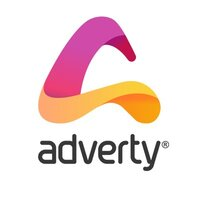
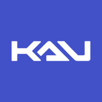
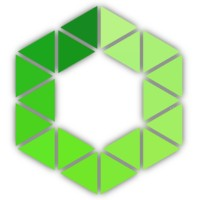

## Contacts
- **Date of birth:** 31.08.1996  
- **Location:** Lviv  
- **Skype:** stas.kaluk  
- **Phone:** +380971460529  
- **Email:** [staskalyuk.096@gmail.com](mailto:staskalyuk.096@gmail.com)  
- **LinkedIn:** [LinkedIn Profile](https://www.linkedin.com/in/stanislav-kaliuk-5a1028132)

---

## Education
### Lviv Polytechnic University (LPU)  
**2013-2017** — Bachelor Degree in Computer Engineering  
**2017-2018** — Master Degree in System Programming  

---

## Courses and Certifications
- **Unity Certified Developer (2017-2019)**  
  - Certification ID: 201704UCD1908  

---

## Work Experience
### Adverty/N-iX

**Position:** Software Engineer  
**Dates:** May 2019 - Present  
#### Responsibilities:
- Planning project architecture and functionalities  
- Developing SDK that contains native libraries and engine plugins using C/C++, C#, Java, Obj-C
- Responsible for SDK rendering on Mobile and Standalone graphics APIs:
  - Vulkan
  - OpenGLES 3.1
  - DirectX 11
  - Metal
- Working with native image capturing using compute shaders and graphics resource management  
- Implementing network-based business logic 
- CI/CD pipelines support using Jenkins and Declarative Jenkins Pipelines
- Project Quality control:
  - Appium for Integration and Regression tests
  - Doctest and Catch2 for Unit testing
  - Catch2 and Nanobench for Performance testing
- Integrating native libraries into popular game engines (Unity, Unreal, Cocos2dx, Godot)  
---

**Project:** [Adverty](https://adverty.com/)  

---

### KAU Inc.  

**Position:** Unity Developer  
**Dates:** February 2018 – April 2019  
#### Responsibilities:
- Full-cycle game development from idea to publishing  
- Planning architecture and functionalities  
- Game UI programming  
- Game push notifications subsystem programming  
- Game localization
- Game optimizations for Apple devices  
- Publishing games on Google Play and iTunes Store
- Implementing third-party plugins:
  - Game Analytics
  - Unity IAP
  - Unity Ads
  - Firebase
  - Facebook SDK  

**Projects:**  
- [Winzzy](https://itunes.apple.com/us/app/winzzy/id1381413113?mt=8)  
- [CuboRush](https://apps.apple.com/us/app/cubo-rush/id1440012757)  

---

### Siligin Software  

**Position:** Unity Developer  
**Dates:** May 2016 – January 2018  
#### Responsibilities:
- Full-cycle game development from design document to publishing  
- Planning architecture and functionalities  
- Game UI programming  
- iOS and WebGL optimization  
- Legacy code support and bug fixing  
- Plugin implementation: 
  - Google Analytics,
  - Unity IAP,
  - Vuforia,
  - Facebook SDK  
- Publishing on Google Play and iTunes Store  

**Projects:** 
- [Gongo Animal Puzzle](https://apkpure.com/gongo-s-animalpuzzle/com.gongo.animalpuzzle)
- [Duplets](https://apkpure.com/duplets/com.creativeminds.duplets)
- [Higher Lower Price Trivia (The Steal Challenge)](https://apkpure.com/higher-lower-price-trivia/com.pushapp.thestealchallenge)
- [FishyPaint](https://itunes.apple.com/us/app/fishypaint/id1157069348?mt=8)  
- [Pidro](https://play.google.com/store/apps/details?id=com.oneapps.pidro&hl=en)  

---

## Additional Projects
- **Greenhouse Controller:**
  - Powered by AVR and STM32
  - **Tech Stack**:
    -  I2C,
    -  ADC,
    -  SPI

- **Eurorack Synthesizer:**
  - VCO
  - Sequencer
  - AR Envelope module
  - **Tech Stack**:
    - Kicad
    - Proteus
    - Testing using Oscilloscope 

- **Game Engine for Roguelike Games:**
  - **Tech Stack**:
    - C23
    - Vulkan
    - ECS
    - 2D Lighting

---

## Hard Skills
### Platform Development
- Windows
- OSX
- Android
- iOS  
- FreeRTOS

### Graphics
- DirectX 11
- Vulkan
- OpenGLES
- Metal  

### Game Engines
- Unity Engine
- Unreal Engine  

### Programming Languages
- C
- C++
- C#
- Java
- JavaScript/TypeScript
- Objective-C
- Python
- Groovy  

### Tools
- CMake
- CubeIDE/CubeMX
- PSoc Creator

### CI/CD
- Jenkins  

### Embedded Systems
**Devices:**
- Arduino (AVR8)
- STM32
- ESP32
- PSoc4
  
**Skills:**
- GPIO
- Timers
- Interrupts
- SWD Debugging

**Communication Protocols:**
- I2C
- SPI
- UART/USART
- CAN
- ADC/DAC

### PCB Design
- KiCad
- EasyEDA
- Proteus (Schematic + PCB + Simulation)  

---

## Soft Skills
### Language Proficiency
- **Ukrainian:** Native  
- **English:** Upper-Intermediate (B2)  

### Professional Qualities
- Strong self-learning motivation  
- Team player with innovative problem-solving skills  
- Open to constructive criticism, responsible, and punctual  
- Prefers detailed pre-planning before development  

---

## Personal Interests and Goals
- Passionate about feature planning & creative projects  
- Open to learning new technologies & problem-solving approaches  
- Enjoys working with highly professional colleagues & sharing knowledge  

---
